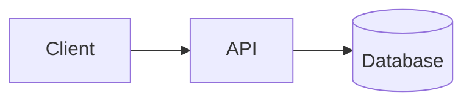

# Service docs

The service answers API calls. Start with the [reference](reference/index.md) or the [guides](guides/index.md).

```mermaid
flowchart LR
  client[Client] --> api[API]
  api --> db[(Database)]
```
